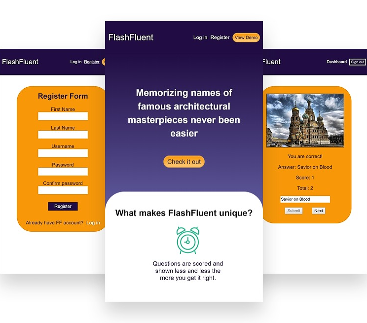

[FlashFluent](https://flashfluent.surge.sh) - Learning App
============================
A learning app that helps architecture buffs to memorize names of the famous buildings. 
It features spaced repetition algorithm that controls how often the users will be prompted 
with a certain card base on the level of their mastery. This MVP was built with a partner 
in 1 week to practice an implementation of Linked List data structure.

Live [demo](https://flashfluent.surge.sh)

## Screenshots

## API Documentation
Can be found [here](https://github.com/valsakel/spaced-repetition-server)

## Tech Stack
* [create-react-app](https://github.com/facebook/create-react-app)
* [React](https://reactjs.org/)
* [Redux](https://redux.js.org/)
* [jwt-decode](https://www.npmjs.com/package/jwt-decode)